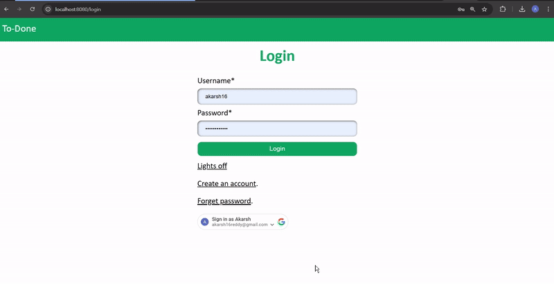
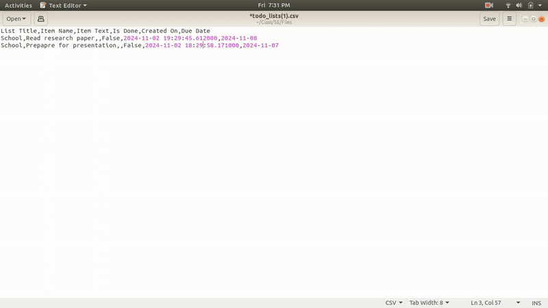
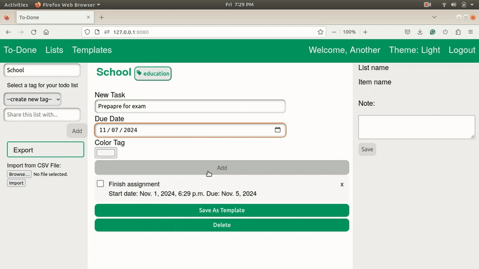
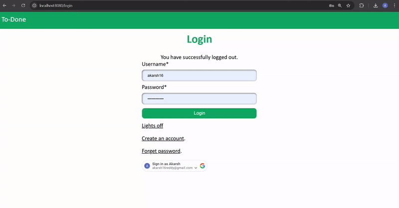

  

<h2 align="center">The Only Todo List You Need</h2>

# TO-DONE
The To-Done Web Application is a dynamic and user-friendly task management platform designed to simplify and enhance productivity for individuals and teams. It provides a seamless way to create, organize, and share to-do lists with collaborators, ensuring that everyone stays aligned and on track.

**Key Features:**

Effortless List Creation: Users can create and manage multiple to-do lists with tags and priorities for better categorization.

Task Tracking: Add notes, set due dates, and assign priority levels to tasks for a clear and structured workflow.

Import/Export Capability: Easily import tasks from CSV files or export lists to share with stakeholders.

Customizable Experience: Tailor your task management experience with flexible filters and tagging options.

**Why Choose To-Done?**

To-Done is designed with simplicity and functionality in mind, catering to users who need an intuitive yet powerful tool to keep track of tasks. Whether you're managing personal goals or coordinating a group project, To-Done ensures that no task is overlooked. Its collaboration features make it ideal for team settings, allowing users to work together effectively.

**Empower your productivity and achieve more with To-Done Web Application—because your tasks deserve to be done, not just planned.**

### Ready to conquer your to-do list? With To-Done, focus on what matters and streamline your workflow. Dive in today and experience how easy task management can be!

### Repo video - TO-DONE 3.0 - Fall 2024 [Watch the video](img/todone-promo.mp4)

https://drive.google.com/file/d/1lL37jl0X8ancEcHooGaRaZOkh_R0i1CX/view?usp=drive_link

### Watch this video to know more about TO-DONE 2.0

https://user-images.githubusercontent.com/23623764/205810552-556e0449-3f81-4e55-ad9a-414de9731b15.mp4

### Watch this video to know more about the original TO-DONE 

### Target Audience
To-Done is ideal for:
- **Students**: Manage assignments and deadlines.
- **Professionals**: Track work tasks and project milestones.
- **Teams**: Collaborate on shared tasks and responsibilities.

Contents
========

 * [Why?](#why)
 * [Features](#key-features-last-version)
 * [New Features](#new-features)
 * [Upcoming Features](#upcoming-features)
 * [Quick Start](#quick-start)
 * [Documentation](#Documentation)
 * [Want to contribute?](#want-to-contribute)
 * [License](#license)
 * [Developer](#developers-new-version)

### Why?

We wanted to work on something that is:

+ Useful, serves some real purpose
+ Easy to start with a basic working version and lends itself to adding new features incrementally to it
+ Easily divisible in modules/features/tasks that can be parallely done by five developers 
+ Diverse enough so that a lot of Software Engineering practices is required/involved 

`to-done` is a todo list app that is actually useful, very easy to create a basic working version with where a ton of new features can be added, touches upon all the aspects of web programming, database, working in a team etc.

### Features 
 * [Register](#register)
 * [Login](#login-forget-password)
 * [Create, Update, Delete Todo Lists](#manage-todo-list)
 * [Quickly Create Todo Lists From Existing Templates](#templates)
 * [Create Your Own Templates](#templates)
 
### Features (Last Version)
 * [Shared List](#shared-todo-lists)
 * [Add Due Date To Tasks](#due-date-color-tags)
 * [Due Date Alerting Mechanism](#due-date-color-tags)
 * [Add Reminder Message to task completed](#due-date-color-tags)
 * [Customized Color Tag](#due-date-color-tags)
 * [Add Tags To Todo Lists For Customizable Grouping](#customizable-grouping-tags)

### New Key Features
 * [Social login - Google Sign-in](#social-login-google-sign-in) 
 * [Import/Export Todo Lists](#importexport-todo-lists)
 * [Dark Mode](#dark-mode)

### Upcoming Features
 * Gamification - earn points by finishing your tasks, show-off your productivity in social media
 * Collaborative Task Management
 * Notification/Reminder Integration
 * Pomodoro Timer Integration
 * [List of All Planned Features for Second Phase](https://github.com/users/shahleon/projects/2/views/6)

### Quick Start

 * Refer to INSTALL.md for setting up & running this project
 
### Documentation
* [Refer to this page](https://software-engineering-project-pkhsak.github.io/To-Done/views.html) for exhaustive documentation

### Features

#### Register

    

#### Login, Forget Password

     

#### Manage Todo List

    
     
     
    

#### Templates

    

#### Customizable Grouping Tags

    

#### Shared ToDo Lists

    

#### Due Date, Color Tags

    

### New Features

#### Social Login: Google Sign-in

    

#### Import/Export Todo Lists

##### Import

    

##### Export

    

#### Dark Mode

    

# Project Funding

Our project is currently not funded, and we operate on a volunteer and open-source basis, and currently, improvement of the project solely relies on the dedication of our team and contributions from the open-source community.

# Future Scope

## 3 month Tasks
1) ### Task Creation and Management:
   Enhance the task creation interface with fields for due dates and priority levels.
   Implementing basic task editing and deletion functionalities.

2) ### User Interface Improvements:
   Conduct user testing to gather feedback on the current UI.
   Make initial UI improvements based on user feedback.

3) ### Basic Notifications:
   Implement email notifications for task deadlines.

## 6 month Tasks
1) ### Collaboration Features
   Develop shared tasks functionality to allow users to collaborate on projects.
   Implement a commenting system for tasks.

2) ### Task Prioritization and Categorization
   Introduce tagging and categorization for tasks.
   Implement priority levels for tasks.

3) ### Enhanced User Interface
    Implement responsive design for mobile compatibility.
    Introduce a dark mode option.

## 12 month Tasks
1) ### Mobile Application Development
    Develop and launch a mobile application for iOS and Android.

2) ### Advanced Search and Filtering
    Implement a robust search feature for tasks.
    Develop filtering options based on date, priority, and category.

3) ### Customizable Dashboards
    Allow users to customize their dashboard layout and displayed information.

### Want to Contribute?

Want to contribute to this project? Learn about [Contributing](CONTRIBUTING.md). Not sure where to start? Have a look at 
the [good first issue](https://github.com/shahleon/smart-todo/issues?q=is%3Aissue+is%3Aopen+label%3A%22good+first+issue%22). 

### Need help?

Found a bug, have a new feature idea or need help with running or deploying the software? Please create an [Issue](https://github.com/Software-Engineering-Project-PKHSAK/To-Done/issues) to notify us.

### License

Distributed under the MIT License. See [LICENSE](LICENSE) for more information.

### Developers (New Version)

<table>
  <tr>
    <td align="center"><a href="https://github.com/vyompatel77"> <b>Vyom Patel</b></a></td>
    <td align="center"><a href="https://github.com/rarchitgupta"> <b>Archit Gupta</b></a> </td>
    <td align="center"><a href="https://github.com/Bhavishya-T"> <b>Bhavishya Tarun</b></a> </td>
  </tr>
</table>

### Developers (Last Version)

* Akarsh Reddy (https://github.com/akarsh16reddy)
* Prateek Kamath (https://github.com/PrateekKamath)
* Himanshu Singh (https://github.com/123standup)
